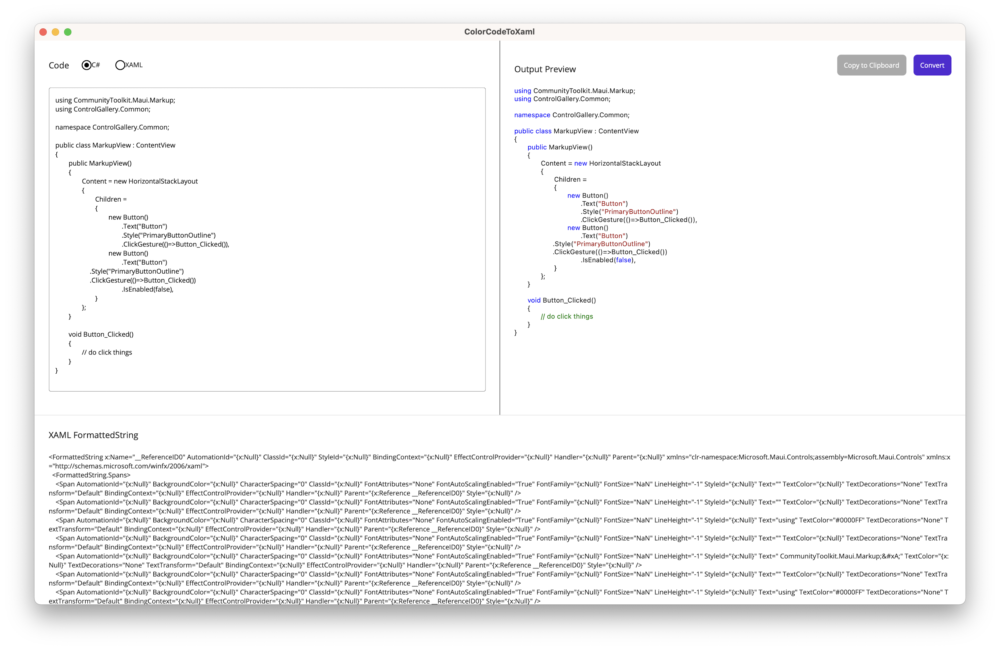

# Styles code strings for display using FormattedString

1. Paste sample code in the Code box specifying the language. 
2. Click "Convert" to generate the preview and render the `FormattedString`
3. Click "Copy to Clipboard" to get the `FormattedString` for use in your XAML.

